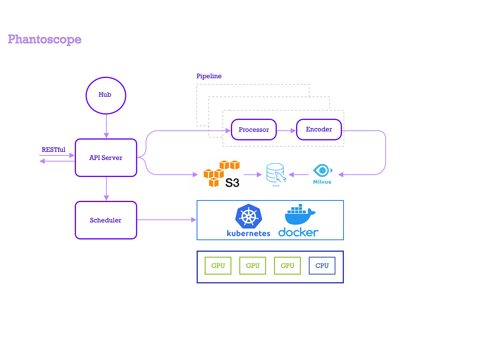

[](https://lgtm.com/projects/g/zilliztech/phantoscope/context:python)
[](https://codecov.io/gh/zilliztech/phantoscope)

Phantoscope is an image search suite powered by Milvus and neutral networks. 

**Extremely high speed in processing and searching billions of images.**

**Compatible with Tensorflow, Pytorch, TensorRT, ONNX, XGBoost, and more.**

**Provides GUI for demonstrating search results and managing Phantoscope data.**

**Soon to establish an extension market, where you can share your extension with the world.**

**Native support for Docker and Kubernetes.**

English | [中文版](README_CN.md) 

## Table of Contents


- [Background](#background)
- [Install](#install)
- [Quick Start](#quick-start)
- [Architecture diagram](#architecture-diagram)
- [Phantoscope Basics](#phantoscope-basics)
- [Tutorial](#tutorial)
- [API reference](#api-reference)
- [Contributing](#contributing)
- [Community](#community)
- [Roadmap](#roadmap)
- [License](#license)

<a href="#background"></a>
## Background

Your search should not be confined to key words and short sentences.

With the explosion of images and video data in human society, the legacy text search can hardly serve people's needs. 


For example, an image involves a myriad of information, and different people have different interpretation of the same image. The existing search engines, be it full-text search or searching image by image, can no longer meet such flexible multi-dimensional search requirements. 

Phantoscope is the right tool for you. Empowered by miscellaneous deep-learning models, portable image processing techniques, and Milvus vector search engine, it can offer a unique set of high-performance image searching interfaces to address such needs.


<a href="#install"></a>
## Install

Download Phantoscope
```bash
$ git clone https://github.com/zilliztech/phantoscope.git && cd phantoscope
```

Set up environment
```bash
$ export LOCAL_ADDRESS=$(ip a | grep -Eo 'inet (addr:)?([0-9]*\.){3}[0-9]*' | grep -Eo '([0-9]*\.){3}[0-9]*' | grep -v '127.0.0.1'| head -n 1)
```
Start Phantoscope containers
```bash
$ docker-compose up -d
```

Check the status of all containers:

``` bash
$ docker-compose ps
```

*You are expected to see the following output:*
```
Name                   Command                          State   Ports
----------------------------------------------------------------------------------------------------------------
phantoscope_api_1      /usr/bin/gunicorn3 -w 4 -b ...   Up      0.0.0.0:5000->5000/tcp
phantoscope_milvus_1   /var/lib/milvus/docker-ent ...   Up      0.0.0.0:19530->19530/tcp, 0.0.0.0:8080->8080/tcp
phantoscope_minio_1    /usr/bin/docker-entrypoint ...   Up      0.0.0.0:9000->9000/tcp
phantoscope_mysql_1    docker-entrypoint.sh mysqld      Up      0.0.0.0:3306->3306/tcp
phantoscope_vgg_1      python3 server.py                Up      0.0.0.0:50001->50001/tcp
```

<a href="#quickstart"></a>
## Quick Start

Click [here](./docs/site/en/quickstart) to set up a basic Phantoscope application. You can use it to upload and search images.

<a href="#architecture"></a>
## Architecture diagram



<a href="#basics"></a>
## Phantoscope basics

- [What is operator](./docs/site/en/tutorials/operator.md)
- [What is pipeline](./docs/site/en/tutorials/pipeline.md)
- [What is application](./docs/site/en/tutorials/application.md)

<a href="#tutorial"></a>
## Tutorial 

- [Use Phantoscope Preview](./docs/site/en/tutorials/preview.md)
- [Create an application](./docs/site/en/examples/object.md)
- [Develop an operator](./operators/HowToAddAnOperator_en.md)

<a href="#tutorial"></a>
## Tutorial 

<a href="#api"></a>
## API reference

Click [here](https://app.swaggerhub.com/apis-docs/phantoscope/Phantoscope/0.1.0) to read our latest RESTful API reference.

<a href="#contributing"></a>
## Contributing

Contributions are welcomed and greatly appreciated. 

Please read our [contribution guidelines](CONTRIBUTING.md) for detailed contribution workflow.

We use [GitHub issues](https://github.com/zilliztech/phantoscope/issues) to track issues and bugs. 

For general questions and public discussions, please join our community.

<a href="#community"></a>
## Community

- Go to [our Slack Channel](https://join.slack.com/t/zillizworkplace/shared_invite/zt-enpvlmud-6gnqhPqQryhQLfj3BQhbew), if you run into issues and want to consult our experts.

<a href="#roadmap"></a>
## Roadmap

[GitHub milestones](https://github.com/zilliztech/phantoscope/milestones) lays out the development plan for Phantoscope. 

We hope you could team up with us in the development of Phantoscope.


<a href="#license"></a>
## License

Apache License 2.0
