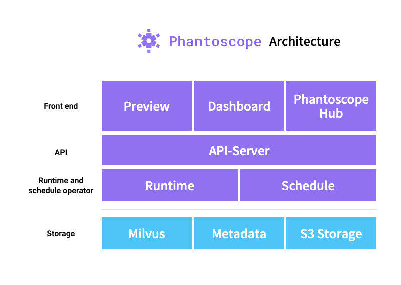

[](https://lgtm.com/projects/g/zilliztech/phantoscope/context:python)
[](https://codecov.io/gh/zilliztech/phantoscope)

Phantoscope 是一个基于 Milvus 与深度学习的云原生图片搜索引擎

**十亿级别的图像的高性能搜索**

**完全兼容 Tensorflow Pytorch TensorRT ONNX XGBoost 等主流深度学习框架,可以在最短五分钟内创建自己的模型扩展**

**提供 gui 验证搜索效果、管理 phantoscope 资源**

**即将提供扩展仓库，在这里可以上传并与全世界的使用者分享你的扩展**

**即将提供扩展运行模式(extension runtime)，原生支持 docker 与 kubernetes**

中文版 | [英文版](README.md)

## Table of Contents

- [背景](#背景)
- [安装](#安装)
- [快速开始](#快速开始)
- [教程](#教程)
- [示例](#示例)
- [API](#API)
- [贡献者指南](#贡献者指南)
- [加入社区](#加入社区)
- [路线图](#路线图)
- [协议](#协议)

## 背景

人类的搜索不应该被局限在单词与短句。

随着音频、视频的数据所占比重越来越大，在未来还会有更多更高维度的数据出现在我们的日常生活当中。

人们需要搜索拥有更高密度信息的数据，目前的图片更复杂的数据。

搜索变成了一件复杂的事情。

单一的文本搜索无法满足维度日益增加的搜索需求。

然而多维度的搜索面临着问题---搜索的重心在哪里?

一张图片中包含的几十个单词构成的信息，不同人在不同条件下搜索的重心各不相同，针对不同场景的多维度搜索成为了重要功能。

人们无法覆盖到所有的使用场景，那么就需要根据不同的场景进行改动，

经过简单组装后即可以提供强大功能与效率的搜索引擎，这就是 Phantoscope。

## 安装
### 安装环境说明
1. docker >= 19.03
2. docker-compose >= 1.25.0
3. python3.5+
### 注意
phantoscope 已经在 x86 架构下 ubuntu 16.04 centos 7.3 以上经过验证

在 macOS 与 windows 下可能会存在未知问题
### 开始安装
```
$ git clone https://github.com/zilliztech/phantoscope.git && cd phantoscope
$ export LOCAL_ADDRESS=$(ip a | grep -Eo 'inet (addr:)?([0-9]*\.){3}[0-9]*' | grep -Eo '([0-9]*\.){3}[0-9]*' | grep -v '127.0.0.1'| head -n 1)
$ docker-compose up -d
```
执行 
``` bash
$ docker-compose ps
``` 

确认所有的容器状态均为 Up

看到如下输出
```
Name                      Command               State                        Ports
----------------------------------------------------------------------------------------------------------------
phantoscope_api_1      /usr/bin/gunicorn3 -w 4 -b ...   Up      0.0.0.0:5000->5000/tcp
phantoscope_milvus_1   /var/lib/milvus/docker-ent ...   Up      0.0.0.0:19530->19530/tcp, 0.0.0.0:8080->8080/tcp
phantoscope_minio_1    /usr/bin/docker-entrypoint ...   Up      0.0.0.0:9000->9000/tcp
phantoscope_mysql_1    docker-entrypoint.sh mysqld      Up      0.0.0.0:3306->3306/tcp
phantoscope_vgg_1      python3 server.py                Up      0.0.0.0:50001->50001/tcp
```
即表示 phantoscope 正在运行


## 产品功能说明
1. 上传与搜索图片
2. 自定义图片处理流程
3. 使用自定义模型处理图片数据
4. 管理上传的图片数据

## 快速开始
从[这里](./docs/site/zh-CN/quickstart)运行一个最小的 Phantoscope 应用,你可以使用它来上传与搜索图片。

## 架构图


## 教程

| Tutorials                                                                                               | level  |
| ------------------------------------------------------------                                                            | ------ |
| [如何使用 phantoscope preview](./docs/site/zh-CN/tutorials/preview.md)                                                  | ⭐     |
| [什么是 operators](./docs/site/zh-CN/tutorials/operator.md)                                                             | ⭐⭐   |
| [什么是 pipeline](./docs/site/zh-CN/tutorials/pipeline.md)                                                              | ⭐⭐   |
| [什么是 application](./docs/site/zh-CN/tutorials/application.md)                                                        | ⭐⭐   |
| [如何开发一个 operator](./operators/HowToAddAOperator.md)                                                               | ⭐⭐⭐ |
## 示例
从 [这里](./docs/site/zh-CN/examples) 你可以看到 Phantoscope 在不同场景下的应用:

 - 根据图片中的人脸进行搜索
 - 根据图片中的物体进行搜索
## API
Phantoscope 使用 swagger 来编写与管理 API 文档，阅读 [这里](./docs/site/zh-CN/openapi/README.md) 获取详情。

## 贡献者指南
我们由衷欢迎您推送贡献。关于贡献流程的详细信息，请参阅 [贡献者指南](CONTRIBUTING.md)。

本项目遵循 Phatoscope [行为准则](CODE_OF_CONDUCT.md)。如果您希望参与本项目，请遵守该准则的内容。

我们使用 [GitHub issues](https://github.com/zilliztech/phantoscope/issues) 追踪问题和补丁。

若您希望提出问题或进行讨论，请加入我们的社区。


## 加入社区

- Slack [频道](https://join.slack.com/t/zillizworkplace/shared_invite/zt-enpvlmud-6gnqhPqQryhQLfj3BQhbew)这里可以进行沟通与咨询在使用过程中遇到的问题
- [公司主页](https://zilliz.com/) 这里可以了解到关于 zilliz 的更多资讯


## 路线图

您可以参考我们的[路线图](https://github.com/zilliztech/phantoscope/milestones)。

包括路线图在内，我们希望更多的人可以一起参与到 Pantoscope 的开发当中。

如果您有任何问题请随时联系我们 phantoscope@zilliz.com。


## 协议

Apache License 2.0
